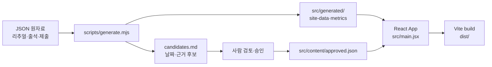

# workstory

> 실제 경험과 기록을 바탕으로, 질문을 미루던 순간을 함께 해결하는 방식으로 다시 쓰는 지원용 자기소개 사이트입니다.

<p align="center">
  
</p>

<p align="center"><sub>대표 화면 · 실제 사이트의 대표작과 지원 문서 영역</sub></p>

<p align="center">
  <a href="docs/verification.md">확인 방법</a>
  ·
  <a href="checklist.md">제출 체크리스트</a>
  ·
  <a href="https://github.com/Gilin03/workstory">Repository</a>
  ·
  <a href="public/assets/login-defense-study-paper.pdf">10번 논문 PDF</a>
</p>

<p align="center">
  
  
  
</p>

## 목차

- [프로젝트 소개](#프로젝트-소개)
- [주요 기능](#주요-기능)
- [화면 구성](#화면-구성)
- [빠른 시작](#빠른-시작)
- [사용 방법](#사용-방법)
- [기술 스택](#기술-스택)
- [시스템 구조](#시스템-구조)
- [프로젝트 구조](#프로젝트-구조)
- [주요 구현 내용](#주요-구현-내용)
- [검증](#검증)
- [제한 사항과 향후 개선](#제한-사항과-향후-개선)

## 프로젝트 소개

`workstory`는 처음 방문한 사람이 짧은 시간 안에 한 사람의 경험과 일하는 방식을 이해할 수 있도록 만든 지원용 자기소개 웹사이트입니다. 2022년 첫 직장에서 겪은 고비에서 시작해, 먼저 인사하고 질문하며 함께 해결하는 행동으로 바뀐 과정을 날짜가 있는 세 장면으로 정리했습니다.

사이트의 본편은 자기소개 이야기이며, 자기조절력·대인관계력·자기동기력이 각 장면에서 어떻게 자랐는지를 보여 줍니다. 이야기 뒤에는 리추얼·출석·제출 현황을 출처와 함께 배치해 회복탄력성과 과제지속력을 보조적으로 확인할 수 있게 했습니다.

사이트와 함께 원자료를 다시 읽어 숫자와 문단 후보를 만드는 로컬 갱신 장치를 제공합니다. 외부 AI나 데이터베이스를 사용하지 않으며, 사람이 승인한 콘텐츠만 공개 화면에 반영합니다.

## 주요 기능

### 이야기 중심 자기소개

- Hero에서 이름과 한 줄 소개를 먼저 보여 줍니다.
- 2022년 고난, 바꾼 행동, 2026년 현재의 세 장면을 차례로 읽을 수 있습니다.
- 각 장면은 날짜·능력·행동의 변화·현재 남은 방식으로 구성됩니다.

### 세 능력의 변화 지도

- 자기조절력·대인관계력·자기동기력을 `그때 → 바꾼 행동 → 지금`으로 나눠 보여 줍니다.
- 각 능력은 9번 서사 문서의 근거와 연결되어 있습니다.

### 출처가 보이는 보조 근거

- 리추얼 기록에서 `26일 기록을 연 날`, `23회 실천했다고 남긴 날`을 계산합니다.
- 출석 원자료의 결석·확정 출석을 기준일과 함께 표시합니다.
- 제출 원자료의 1~11번 상태를 계산해 `11/11개`로 표시합니다.
- 출석률은 표시하지 않으며, 숫자는 이야기 뒤의 보조 근거로만 사용합니다.

### 대표작과 지원 문서

- 10번 논문 PDF를 로그인 없이 열 수 있는 로컬 파일로 제공합니다.
- 아직 완료되지 않은 13번 앱은 준비 중 자리로 남겨 둡니다.
- 이력서·자기소개서·경력기술서를 하나의 DOCX 파일로 제공합니다.

### 결정적 갱신 장치

- JSON 원자료를 넣고 `npm run generate`를 실행하면 숫자와 능력별 문단 후보를 다시 만듭니다.
- 후보에는 날짜와 입력 파일 근거가 포함됩니다.
- 같은 입력을 두 번 처리하면 출력 파일이 바이트 단위로 같습니다.
- 승인한 문장만 `src/content/approved.json`에 반영되므로 자동 생성 문장이 바로 공개되지 않습니다.

## 화면 구성

1. **Hero** — 이름, 한 줄 소개, 일하는 방식, 이야기·대표작으로 가는 입구
2. **나의 이야기** — 날짜가 있는 세 장면과 고난에서 현재로 이어지는 본편
3. **세 능력이 자란 방식** — 세 능력의 전·후 변화 지도
4. **기록은 근거로만** — 리추얼·출석·제출 현황의 출처 표시
5. **대표작과 지원 문서** — 논문, 앱 준비 자리, 지원 문서, 갱신 장치 흐름

## 빠른 시작

### 요구 사항

- Node.js와 npm
- 검증 환경: Node.js `v24.20.0`, npm `11.19.0`
- 데이터베이스, 로그인, 환경 변수, 외부 API 키는 필요하지 않습니다.

### 설치

```bash
npm install
```

### 원자료 생성

```bash
npm run generate
```

### 개발 서버 실행

```bash
npm run dev
```

터미널에 표시된 localhost 주소를 브라우저에서 엽니다. 포트는 사용 중인 환경에 따라 Vite가 선택합니다.

### Production 빌드

```bash
npm run build
npm run preview
```

## 사용 방법

### 사이트를 읽는 흐름

1. Hero에서 이름과 한 줄 소개를 확인합니다.
2. `이야기부터 읽기`를 눌러 2022년 고비부터 현재까지의 본편을 읽습니다.
3. `능력`에서 세 능력이 어떤 행동으로 자랐는지 확인합니다.
4. `근거`에서 이야기 뒤의 숫자와 각 원자료 출처를 확인합니다.
5. `대표작 보기`에서 논문 PDF와 지원 문서를 엽니다.

### 새 기록으로 사이트 갱신하기

1. `inputs/ritual-history.json`, `inputs/attendance.json`, `inputs/submissions.json`을 최신 원자료로 교체합니다.
2. `npm run generate`를 실행해 `src/generated/site-data.json`, `metrics.json`, `candidates.md`를 다시 만듭니다.
3. `candidates.md`의 날짜와 근거를 사람이 검토하고, 승인한 내용만 `src/content/approved.json`에 반영합니다.
4. `npm run build`를 실행해 공개할 정적 결과물을 만듭니다.

`submissions.json`은 현재 과제 12 진행 중인 상황에 맞춰 1~11번 제출 완료로 기록되어 있습니다. 최신 기록으로 교체할 때는 실제 상태만 입력해야 하며, 확인하지 못한 숫자는 추가하지 않습니다.

### 입력 파일과 출력

| 입력 | 역할 | 현재 확인된 내용 |
| --- | --- | --- |
| `inputs/ritual-history.json` | 리추얼 기록 계산과 문단 후보 생성 | 26일 open, 25회 close, 23회 실천 |
| `inputs/attendance.json` | 출석 보조 근거 계산 | 2026-09-17 기준, 결석 0일, 확정 출석 26/27일 |
| `inputs/submissions.json` | 제출 현황 계산 | 2026-09-18 기준, 1~11번 제출 완료 |
| `src/content/approved.json` | 사람이 승인한 공개 콘텐츠 | 자기소개·세 능력·대표작·연락 수단 |

| 출력 | 역할 |
| --- | --- |
| `src/generated/site-data.json` | 사이트용 숫자와 누락 원자료 상태 |
| `src/generated/metrics.json` | 숫자만 모은 생성 결과 |
| `src/generated/candidates.md` | 날짜·근거가 붙은 능력별 문단 후보 |

## 기술 스택

| 영역 | 기술 | 사용 목적 |
| --- | --- | --- |
| UI | React | 승인된 JSON 콘텐츠와 생성된 근거를 단일 페이지로 렌더링 |
| 개발 서버·빌드 | Vite | 개발 서버와 정적 production build |
| 스타일 | Plain CSS | 편집형 레이아웃, 반응형 규칙, 가독성 조정 |
| 갱신 장치 | Node.js ESM | JSON 원자료 계산과 후보 문단 생성 |
| 문서 생성 | Python `python-docx` | 지원 서류 DOCX 생성 |
| 입력·콘텐츠 | JSON·Markdown | 원자료와 사람이 승인한 콘텐츠 분리 |

## 시스템 구조



- `inputs/`는 원자료를 보관합니다.
- `scripts/generate.mjs`는 현재 시각이나 외부 API를 사용하지 않고 입력값만 계산합니다.
- `src/content/approved.json`은 사람이 공개를 승인한 콘텐츠입니다.
- `src/generated/`는 장치가 계산한 숫자와 후보입니다.
- React 화면은 두 데이터를 읽어 정적 페이지를 만들고, Vite가 `dist/`에 빌드합니다.

## 프로젝트 구조

```text
workstory/
├── src/
│   ├── content/approved.json       # 사람이 승인한 공개 콘텐츠
│   ├── generated/                  # generator가 만든 숫자·후보
│   ├── main.jsx                    # 페이지 섹션과 링크 렌더링
│   └── styles.css                  # 편집형 레이아웃과 반응형 스타일
├── scripts/
│   ├── generate.mjs                # 원자료 계산·후보 생성
│   ├── generate.test.mjs           # 결정성 테스트
│   ├── content-check.mjs           # 이야기·능력·금지 수치 검사
│   ├── privacy-check.mjs           # 이메일·비밀값 검사
│   └── create_application_doc.py   # 지원 서류 DOCX 생성
├── inputs/                         # 리추얼·출석·제출 원자료
├── public/
│   ├── assets/                     # 10번 논문 PDF
│   └── documents/                  # 지원 서류 DOCX
├── docs/
│   ├── images/overview.png         # 실제 실행 화면
│   └── verification.md             # 짧은 확인 방법
├── deliverables/                  # 제출용 DOCX·갱신 장치 ZIP
├── checklist.md                    # BRA-A 요구사항 점검표
├── package.json
└── vite.config.js
```

## 주요 구현 내용

### 승인 콘텐츠와 계산 결과 분리

자동 계산 결과와 공개 문장을 같은 파일에 섞지 않았습니다. `approved.json`은 사람이 확인한 자기소개와 연락 수단을 담고, `site-data.json`은 원자료에서 계산한 수치와 출처를 담습니다. 이 경계 덕분에 새 기록을 넣어도 승인하지 않은 문장이 사이트에 바로 노출되지 않습니다.

### 입력값 기반 결정성

생성기는 현재 시각·외부 AI·네트워크에 의존하지 않습니다. 리추얼·출석·제출 JSON의 값만 사용하므로 동일한 입력에 동일한 `site-data.json`, `metrics.json`, `candidates.md`를 생성합니다.

### 이야기 우선 정보 구조

회복탄력성과 과제지속력 숫자를 Hero의 핵심 성과처럼 키우지 않고, 세 장면의 자기소개 뒤에 보조 근거로 배치했습니다. 출석률은 과제 필수 항목이 아니므로 표시하지 않으며, 출석 수치에는 원자료 기준일을 함께 표시합니다.

### 개인정보와 비밀값 검사

`privacy-check.mjs`는 `src`, `public`, `docs`, `inputs`, `scripts`를 검사해 허용된 본인 공개 이메일 외의 이메일, 비밀번호·토큰·API 키 형태의 문자열을 찾습니다.

## 검증

### 자동 검증

| 명령 | 확인 내용 | 최근 결과 |
| --- | --- | --- |
| `npm run generate` | 원자료에서 사이트 데이터 생성 | metric 6개, 누락 원자료 0개 |
| `npm run test:generator` | 두 임시 폴더의 생성 결과 바이트 비교 | 1개 테스트 통과 |
| `npm run check:content` | 본편 분량·날짜·세 능력·금지 수치 검사 | 1,323자, 세 능력 확인 |
| `npm run check:privacy` | 개인정보·비밀값 검사 | 통과 |
| `npm run build` | production 정적 빌드 | Vite 종료 코드 0 |

### 제출 ZIP 재현 확인

제출 ZIP을 새 임시 폴더에 풀고 `npm ci --offline` 후 위 생성·테스트·콘텐츠·개인정보·빌드 명령을 다시 실행했습니다. 동일한 입력에서 생성기 테스트와 빌드가 통과했습니다.

### 수동 확인

- 브라우저에서 로컬 사이트를 열어 Hero, 이야기, 세 능력, 근거, 대표작, 지원 문서 섹션을 확인했습니다.
- 1280px 화면에서 가로 넘침이 없고 콘솔 오류·경고가 없는 것을 확인했습니다.
- 논문 PDF와 DOCX 링크가 로컬 서버에서 열리는 것을 확인했습니다.
- 공개 제출 전에는 배포된 HTTPS 주소를 새 시크릿 창에서 다시 확인해야 합니다.

## 제한 사항과 향후 개선

- 현재 저장소에는 공개 배포 URL이 없으므로 README 상단에 Live Demo 링크를 넣지 않았습니다.
- 13번 앱은 아직 완료되지 않아 실제 링크 대신 준비 중 카드로 남겨 두었습니다.
- 출석 기록은 외부 시스템에서 자동 동기화하지 않고 `inputs/attendance.json`을 교체해 갱신합니다.
- 실제 제출 단계에서는 HTTPS 공개 URL을 확정하고, 시크릿 창에서 로그인 없이 열리는지 확인해야 합니다.
- 13번 앱이 완료되면 대표작 카드의 준비 중 문구를 실제 링크와 설명으로 교체합니다.
